<div align="center">


# Weatherise

### The best weather is the weather you planned for.

**A multi-agent AI system that turns forecasts from seven sources into clear go / no-go decisions<br/>for tourism, construction, and agriculture in Da Nang.**

🏆 **Top 10 Finalist · Vietnam AI Open Hackathon 2026** (DSAC × NVIDIA × Viettel × Sovico)


[**Try the demo**](#-quick-start) · [**How it works**](#-how-it-works) · [**Architecture**](#-system-architecture) · [**Results**](#-validated-results) · [**Team**](#-team)

<br/>

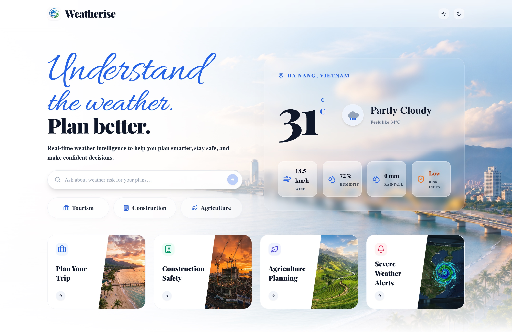

</div>

---

## 📋 Table of Contents

1. [Why Weatherise](#-why-weatherise)
2. [What It Does](#-what-it-does)
3. [Showcase Questions](#-showcase-questions)
4. [Product Tour](#-product-tour)
5. [How It Works](#-how-it-works)
6. [System Architecture](#-system-architecture)
7. [Tech Stack](#-tech-stack)
8. [Validated Results](#-validated-results)
9. [How Weatherise Compares](#-how-weatherise-compares)
10. [Quick Start (Web Demo)](#-quick-start)
11. [Full-Stack Deployment](#-full-stack-deployment)
12. [Repository Structure](#-repository-structure)
13. [Team](#-team)
14. [References](#-references)

---

## 🌧 Why Weatherise

Weather costs Da Nang more than a bad day. Four problems stand between a forecast and a safe decision:

| | Problem | The number |
|---|---|---|
| **01 · Tourism** | When the forecast misses, the trip is lost. In one week of the Oct–Nov 2025 rains, Hue lost 5,000 room bookings and VND 20 billion. | **30–40%** of tour customers canceled or postponed [1] |
| **02 · Forecast models** | One forecast box covers a mountain and a beach. Son Tra's peak and My Khe beach share a single value, so local storms slip between grid points. | **9–13 km** grid spacing of ECMWF and NOAA GFS [3][4] |
| **03 · The decision gap** | Raw numbers are not decisions. An app says "gusts 62 km/h" and stops; whether a crane must halt or urea will wash off depends on rules no forecast applies. | **79%** of heat-stress work hours lost by 2030 fall on agriculture and construction [7] |
| **04 · Fragile AI** | One source fails, one chatbot guesses. Most tools trust a single weather API, and general LLMs fill gaps with confident guesses. | **14.3%** hallucination rate of a leading reasoning model on summaries [9] |

Context: Da Nang welcomed **10.9 million visitors** in 2024 [2]; in October 2025 nearby Bach Ma logged **1,740 mm of rain in 24 hours**, a national record [6]; Typhoon Yagi cost Vietnam's farms **VND 30.8 trillion** [8].

---

## ✨ What It Does

**Forecasts in. Decisions out.** Weatherise is a domain-aware multi-agent system: you ask a question in plain English or Vietnamese, specialized agents gather the right context, weigh a multi-source forecast against real safety rules, and hand back a plan you can act on, with the evidence behind every call.

| | Tourism | Construction | Agriculture |
|---|---|---|---|
| **Decides** | Where to go each day, when, and what to eat | When to pour concrete, when cranes must stop | When to irrigate, fertilize, and spray |
| **Rules applied** | Per-place rain & wind limits, heat and UV rules | Concrete pouring (rain, humidity, temp), crane gust & lightning limits | Field water balance, urea washout, spray dry-time |
| **Context sources** | Attractions, restaurants, local specialties | Site profiles (Hoa Lien Overpass, BRT corridor…) | Co-op profiles (Hoa Vang rice, 145.5 ha…) |

**Core capabilities**

- 🗣 **Ask in plain language.** A parser agent extracts domain, place, dates, and every sub-question; each one gets its own answer, in order.
- ☁️ **Seven sources, one forecast.** Open-Meteo, OpenWeatherMap, WeatherAPI, Tomorrow.io, Visual Crossing, 7Timer, and Stormglass are fetched in parallel, quality-checked, and fused (Path B), with a Nemotron arbiter settling disagreements and an agreement score on every answer.
- 📏 **Rules that know your domain.** A deterministic engine checks every threshold and shows pass / fail evidence. The LLM explains; it never overrides a safety rule.
- 🔁 **Plans that move with the weather.** Outdoor stops shift to dry hours, indoor stops cover storms, and every change is explained.
- 📡 **Pipeline Monitor.** Every question is traced step by step in `/monitor`, live across tabs, and kept after refresh.

---

## 💬 Showcase Questions

Three questions that exercise the full pipeline. All share one demo forecast week (Wed, Jun 10 – Tue, Jun 16, 2026, with a thunderstorm on Friday 13:00–17:00), so every domain reacts to the same weather.

| Domain | Question | Weatherise answers |
|---|---|---|
| 🏖 **Tourism** | *"Is the weather good for a 3-day trip to Da Nang and Hoi An starting tomorrow? Plan each day around the weather and include local specialties I should try."* | **Good to Go.** All 3 days work; Marble Mountains moves from 14:00 to 08:30 (rain 75% > the site's 60% limit); Friday's storm block is indoors; 9 local specialties (Mì Quảng, Cao Lầu, Bánh Xèo…) built in. |
| 🏗 **Construction** | *"We plan to pour the deck slab at Hoa Lien Overpass on Friday morning and run the tower crane all day. Is Friday safe? If not, when is the best pour window this week, and when must the crane stop?"* | **Reschedule.** Friday fails 5 of 6 rules; pour Thursday 06:30–10:30 (passes 6 of 6); halt the crane Friday 12:00–17:00 (gusts 62 km/h > 60, lightning within 10 km). |
| 🌾 **Agriculture** | *"Our Hoa Vang rice cooperative (145 ha) is at tillering. Do we need to irrigate this week, and when should we top-dress urea and spray for rice blast so rain doesn't wash it off?"* | **Skip Irrigation.** Field water stays 3.2–5.0 cm; spray Thursday 08:00–11:00 (26 h rain-free); top-dress urea Saturday 06:00–09:00; rice-blast alert Fri 13:00 – Sat 06:00. |

<div align="center">
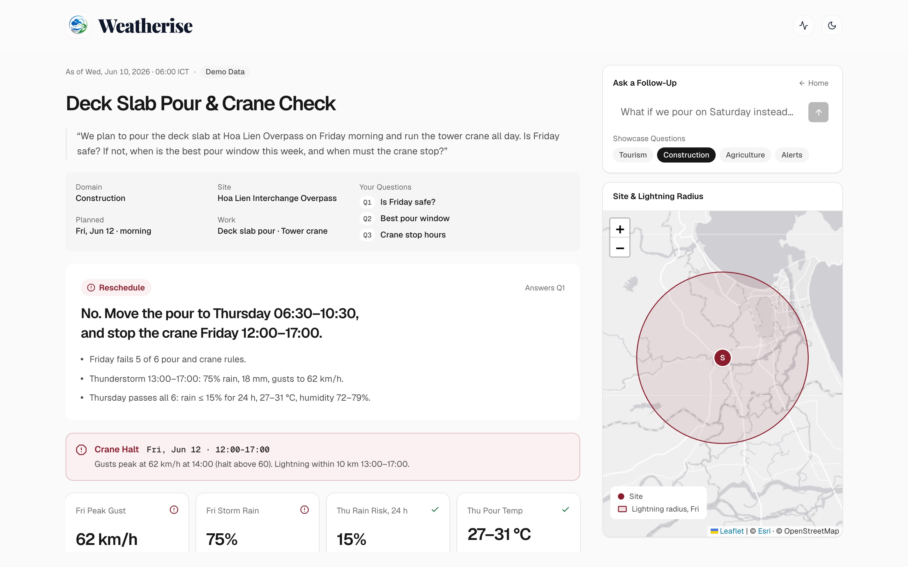
<br/><sub>The construction answer: verdict, alert, key metrics, rule check, hourly chart, and the site map.</sub>
<br/><br/>
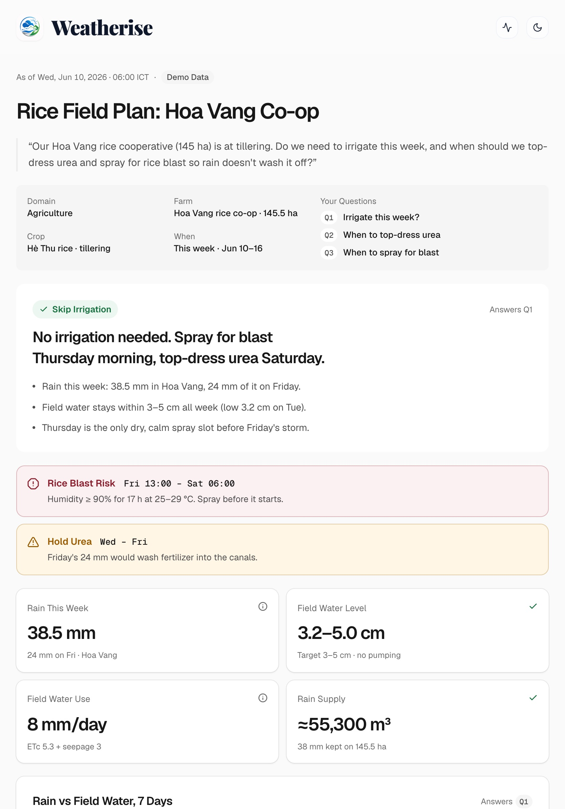
&nbsp;&nbsp;
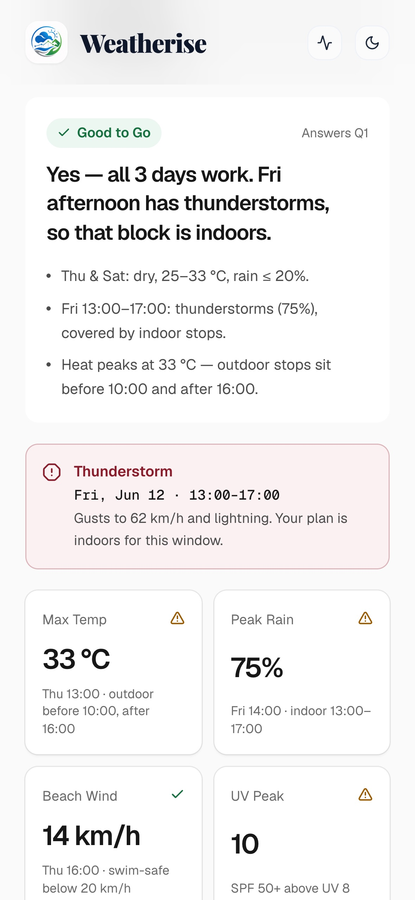
</div>

Every answer follows the same structure: **Prompt → Parsed Request → Verdict → Alerts → Key Metrics → Charts → Answers per question → Rule Check → Sources & Pipeline.**

---

## 🎬 Product Tour

Four short reels (with sound) rendered from the product UI. Click a poster to play.

| Ask in Plain Language | Seven Sources, One Forecast |
|---|---|
| [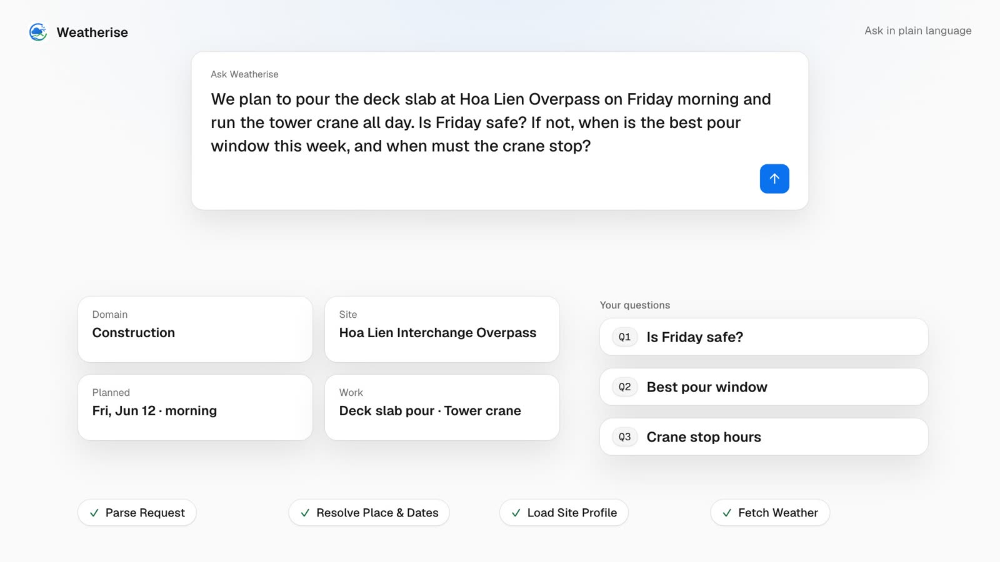](apps/web/public/videos/ask.mp4) | [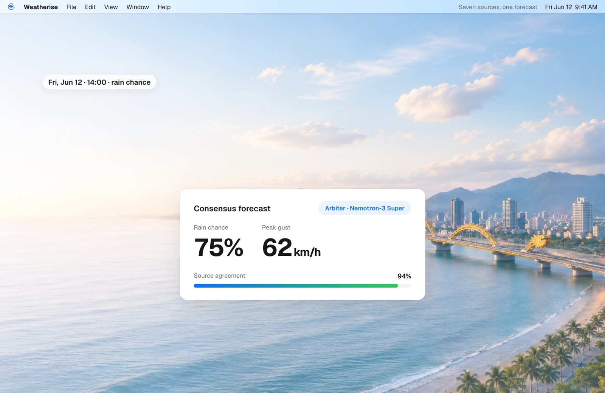](apps/web/public/videos/consensus.mp4) |
| **Rules That Know Your Domain** | **Plans That Move With the Weather** |
| [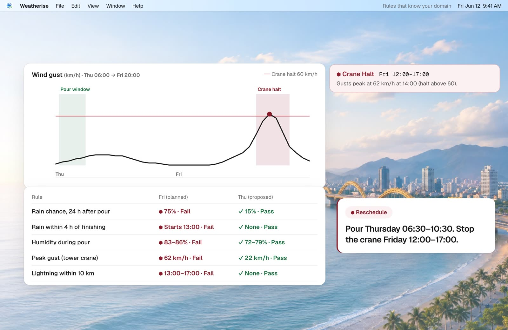](apps/web/public/videos/rules.mp4) | [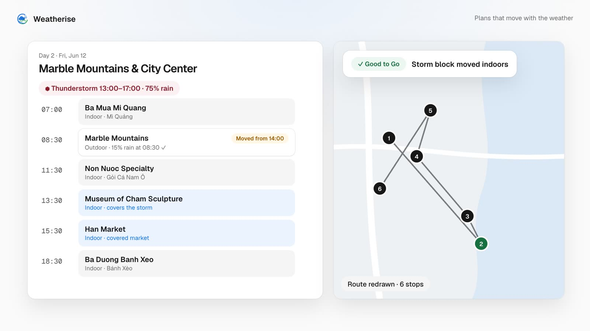](apps/web/public/videos/replan.mp4) |

Rebuild the reels with `node apps/web/video/render.mjs` (needs Chrome and ffmpeg).

---

## 🔄 How It Works

From question to decision, in one pipeline:

| # | Step | Runs on | Example output (construction question) |
|---|---|---|---|
| 1 | **Parse** | Qwen 3.5 27B · vLLM | `{ domain: "construction", site: "Hoa Lien Overpass", when: "Fri, Jun 12", asks: 3 }` |
| 2 | **Orchestrate** | LangGraph | `route → ConstructionContextAgent` |
| 3 | **Gather Context** | MCP tools · Qdrant RAG | `site 16.001, 108.152 · tower crane · deck slab pour` |
| 4 | **Fetch Weather** | MCP · 7 providers | `hourly, Thu 06:00 → Fri 20:00` |
| 5 | **Reach Consensus** | Path B · Nemotron arbiter | `rain 75% · gust 62 km/h · agreement 92%` |
| 6 | **Apply Rules** | Deterministic rule engine | `Friday: 5 of 6 rules fail · Thursday: 6 of 6 pass` |
| 7 | **Answer** | Nemotron-3 Super · NVIDIA NIM | `Reschedule → pour Thu 06:30–10:30 · crane halt Fri 12:00–17:00` |

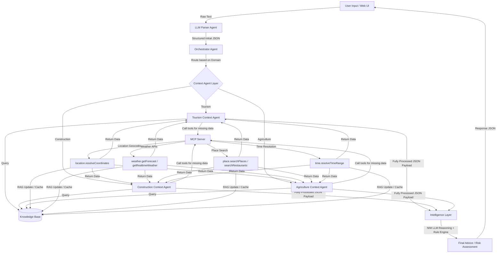

**Key principles**

1. Deterministic risk scoring; the LLM cannot override a safety rule.
2. Multi-source weather intelligence (Path B) with an agreement score.
3. Domain-specific context and decision rules.
4. Explainable recommendations, with sources and confidence on every answer.

---

## 🏗 System Architecture

Containerized microservices behind an Nginx reverse proxy: the API gateway, agent layer, MCP tool gateway, knowledge layer (RAG), intelligence layer, and data infrastructure.


### Runtime Data Flow

Natural-language request → Qwen parser → orchestrator and context agents (with Qdrant, PostgreSQL + PostGIS, and Redis, plus MCP for live APIs) → intelligence layer (Earth2Studio processing, multi-source fetcher, source normalizer, quality validation, Nemotron-3 Super) → fully processed payload → natural-language answer in Vietnamese or English.


More detail: [`docs/system_architecture.md`](docs/system_architecture.md) · [`docs/data_flow.md`](docs/data_flow.md) · [`docs/sequence_diagram.md`](docs/sequence_diagram.md)

---

## 🛠 Tech Stack

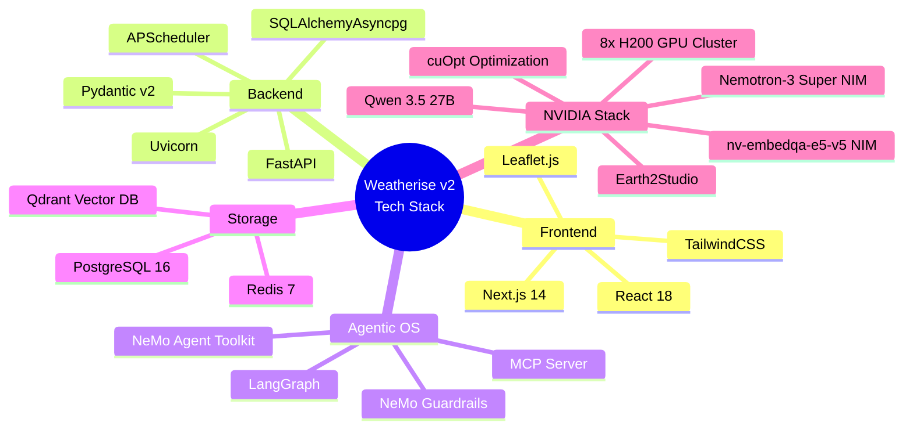

| Layer | Component | Role |
| :--- | :--- | :--- |
| **Frontend** | **Next.js 14 (App Router)** | Landing page, the answer app (`/app`) with report views, Leaflet maps and SVG charts, and the Pipeline Monitor (`/monitor`). |
| **Backend** | **FastAPI** | API gateway with WebSocket streaming and a background scheduler. |
| **AI Orchestration** | **LangGraph & NeMo Agent Toolkit** | Multi-agent routing and safety guardrails. |
| **Foundation Models** | **NVIDIA NIM** | Nemotron-3 Super 120B (reasoning & arbiter), Qwen 3.5 27B (parser & localizer), nv-embedqa-e5-v5 (embeddings). |
| **Tools** | **Model Context Protocol** | Standardized tools: `location.resolveCoordinates`, `time.resolveTimeRange`, `weather.getForecast`, `place.searchPlaces`, `place.searchRestaurants`, `map.generateTripRoute`. |
| **Storage** | **Qdrant, PostgreSQL + PostGIS, Redis** | RAG vector search, geospatial entities, caching and sessions. |
| **GPU Engine** | **NVIDIA cuOpt & Earth2Studio** | Route optimization and Earth-2 forecast processing on 8× H200. |

Full matrix: [`docs/tech_stack.md`](docs/tech_stack.md) · [`docs/tech_stack_and_metrics_summary.md`](docs/tech_stack_and_metrics_summary.md)

---

## 📊 Validated Results

Measured by the team during the Vietnam AI Open Hackathon, June 2026.

| Metric | Result | Sample | Method |
|---|---|---|---|
| **Forecast error** (MAE vs. raw GFS / ECMWF) | **−21.4%** | 180 historical days | WMO-No. 1485 verification against Da Nang station data and ERA5 |
| **Median latency** (vs. a sequential GPT-4o ReAct baseline) | **9.37 s** | 1,247 test runs | Wall-clock time on 8× NVIDIA H200 |
| **Context recovery** (missing details filled via MCP & RAG) | **87.3%** (156 / 179) | 179 queries | ContextGapReport audit trail across 3 domains |
| **Safety violations** under red-team attack | **0 / 212** | 212 adversarial prompts | NeMo Guardrails against TCVN 5574:2018 & QCVN 18:2021/BXD |

---

## ⚖️ How Weatherise Compares

| Capability | Weatherise | Windy | Tomorrow.io | General AI chatbot |
|---|:---:|:---:|:---:|:---:|
| Fuses many forecast providers into one answer | ✅ | ◐ shows models side by side [12] | ◐ own models | ❌ |
| Plain-language question in, action plan out | ✅ | ❌ | ✅ Gale agent [14] | ✅ |
| Thresholds with pass / fail evidence | ✅ | ❌ | ✅ user-defined [13] | ❌ |
| Vietnamese codes & Da Nang context built in | ✅ | ❌ | ❌ | ❌ |
| Tourism, construction & agriculture in one system | ✅ | ❌ | ◐ | ◐ |
| Grounded in live forecasts, not guesses | ✅ | ✅ | ✅ | ◐ [9] |

✅ yes · ◐ partial · ❌ no. Based on each product's public documentation.

---

## 🚀 Quick Start

The web app runs **fully standalone** on mock data, with no GPUs or API keys needed. It's the fastest way to see every feature.

```bash
git clone https://github.com/BennedictQuanTon/WeatherRise-2026.git
cd WeatherRise-2026
npm install          # npm workspaces: installs apps/web
npm run dev          # → http://localhost:3000
```

| Route | What you'll see |
|---|---|
| `/` | Landing page: problem, product tour, architecture, results, team |
| `/app` | The answer app. Pick a showcase question or ask your own; answers are shareable via URL, e.g. `/app?q=construction` |
| `/monitor` | Pipeline Monitor: every question's steps and timings, synced live across tabs |

**Connect the real backend.** By default `/api/chat` answers from the built-in demo engine (`apps/web/app/api/mockData.ts`). To forward questions to the FastAPI pipeline instead:

```bash
USE_BACKEND=true API_URL=https://your-backend.example.com npm run dev
```

---

## 🐳 Full-Stack Deployment

Runs the complete agentic backend: API, MCP server, Qdrant, PostgreSQL, Redis, and the web client, behind Nginx.

### Prerequisites

* Docker and Docker Compose
* An NGC API key for NVIDIA NIM (or pre-launched local NIM containers)

### Step 1: Set up environment variables

```bash
cp .env.example .env
```

Fill in:
* `NGC_API_KEY`: your NVIDIA NGC API token.
* Weather provider keys (`OPENWEATHERMAP_API_KEY`, `WEATHERAPI_KEY`, `TOMORROW_IO_API_KEY`, `VISUAL_CROSSING_API_KEY`, `STORMGLASS_API_KEY`). Open-Meteo and 7Timer need no key.

### Step 2: Launch with Docker Compose

```bash
docker-compose -f infra/docker-compose.yml up -d
docker ps
```

Everything is served through the Nginx reverse proxy on port `8080`:
* **Web client:** `http://localhost:8080/`
* **API gateway:** `http://localhost:8080/api`
* **WebSocket:** `ws://localhost:8080/ws`

### Step 3: Seed the databases

1. **Initialize PostgreSQL:**
   ```bash
   docker exec -i weatherise-postgres psql -U weatherise -d weatherise < storage/postgres/locations_schema.sql
   docker exec -i weatherise-postgres psql -U weatherise -d weatherise < storage/postgres/context_observability_tables.sql
   ```
2. **Seed Qdrant RAG collections and reference data:**
   ```bash
   python knowledge/scripts/seed_all.py
   ```

### Run the tests

```bash
pytest tests/
```

---

## 📁 Repository Structure

```text
WeatherRise-2026/
├── apps/
│   ├── web/                    # Next.js 14 front end
│   │   ├── app/                #   /  (landing) · /app (answers) · /monitor · /api/*
│   │   ├── components/         #   landing/, report/ (answer views), map/, legacy/
│   │   ├── lib/                #   report types, demo week & rules, run traces
│   │   ├── public/             #   images, device shots, product-tour reels
│   │   └── video/              #   reel scenes + renderer (Chrome + ffmpeg)
│   └── api/                    # FastAPI gateway, routes, response view composer
├── agents/
│   ├── parser_agent/           # Natural-language → structured intent
│   ├── orchestrator/           # LangGraph state machine
│   ├── context_agents/         # Tourism, construction, agriculture agents
│   └── intelligence_layer/     # Prediction engine, NIM client, Path B weather fusion
├── mcp/                        # MCP tool server: location, time, weather, places, maps
├── knowledge/                  # RAG pipeline, retrievers, Qdrant client, seed data
├── storage/postgres/           # SQL schemas
├── data/                       # Places, sites, restaurants, weather evidence
├── infra/                      # docker-compose, Nginx, NVIDIA deploy scripts
├── docs/                       # Architecture, data flow, sequence diagrams
└── tests/                      # API, pipeline, and Path B tests
```

---

## 👥 Team

Four builders from **HCMUT – UTS**, guided by three NVIDIA mentors.

<table>
  <tr>
    <td align="center" width="25%"><br/><b>Long Quan Ton</b><br/><sub>Project Lead · AI Developer</sub></td>
    <td align="center" width="25%"><br/><b>Khanh Tuong Huynh</b><br/><sub>Technical Lead · AI Developer</sub></td>
    <td align="center" width="25%"><br/><b>Yoshio Nomura</b><br/><sub>LLMOps · AI Developer</sub></td>
    <td align="center" width="25%"><br/><b>Gia Thanh Le</b><br/><sub>UI/UX Designer</sub></td>
  </tr>
</table>

**Mentors**

| Mentor | Role |
|---|---|
| **Mr. Yash Gupta** | Senior Solution Architect · NVIDIA India |
| **Mr. Van Le** | Head of AI/ML · NVIDIA USA |
| **Mr. Tran Minh Quan** | Senior Developer Technology Engineer · NVIDIA Vietnam |

Built at the **Vietnam AI Open Hackathon 2026** (Jun 9–12, Da Nang), organized by DSAC with NVIDIA, Viettel, Sovico Group, OpenACC, and Open Hackathons [10][11].

<div align="center">
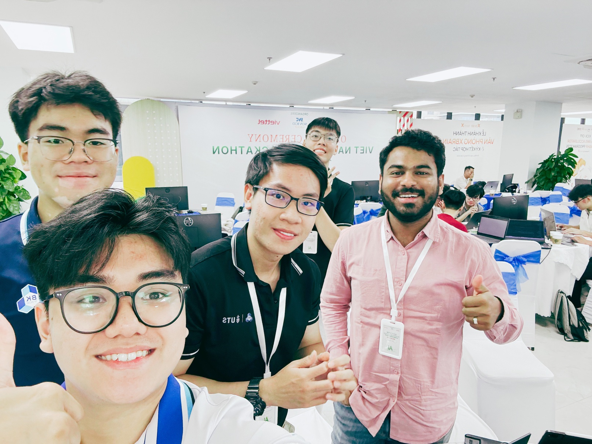
</div>

---

## 📚 References

Accessed Oct 3, 2026.

1. VnExpress International, [Storms, floods disrupt tourism in central Vietnam](https://e.vnexpress.net/news/travel/storms-floods-disrupt-tourism-in-central-vietnam-4960387.html), Nov 6, 2025.
2. VietnamPlus, [Da Nang looks to attract 11.9 million tourists in 2025](https://en.vietnamplus.vn/da-nang-looks-to-attract-119-million-tourists-in-2025-post307707.vnp), 2025.
3. ECMWF Newsletter 176, [IFS upgrade unifies medium-range resolutions (9 km)](https://www.ecmwf.int/en/newsletter/176/earth-system-science/ifs-upgrade-brings-many-improvements-and-unifies-medium), Jul 2023.
4. NOAA EMC, [Global Forecast System (GFS), ~13 km](https://www.emc.ncep.noaa.gov/emc/pages/numerical_forecast_systems/gfs.php).
5. SGGP News, [Da Nang suffers over VND 837 bln in damage from historic late-October floods](https://en.sggp.org.vn/da-nang-city-suffers-over-vnd837-bln-in-damage-from-historic-late-october-floods-post121451.html), Nov 2025.
6. Wikipedia, [2025 Central Vietnam floods](https://en.wikipedia.org/wiki/2025_Central_Vietnam_floods).
7. International Labour Organization, [Working on a warmer planet](https://www.ilo.org/publications/major-publications/working-warmer-planet-effect-heat-stress-productivity-and-decent-work), Jul 2019.
8. VietNamNet, [Economic toll from Typhoon Yagi tops $3.4 billion](https://vietnamnet.vn/en/economic-toll-from-typhoon-yagi-tops-3-4-billion-2326935.html), Oct 2024.
9. Vectara, [DeepSeek-R1 hallucinates more than DeepSeek-V3 (HHEM 2.1)](https://www.vectara.com/blog/deepseek-r1-hallucinates-more-than-deepseek-v3), Jan 30, 2025.
10. Vietnam.vn, [Launching the Vietnam AI Open Hackathon 2026](https://www.vietnam.vn/en/khoi-dong-cuoc-thi-vietnam-ai-open-hackathon-2026), 2026.
11. Createwith, [Vietnam AI Open Hackathon 2026, Da Nang](https://www.createwith.com/event/da-nang-vietnam-ai-open-hackathon-2026-jun-2026), Jun 2026.
12. Windy Community, [Understanding the Compare Forecast feature](https://community.windy.com/topic/26304/understanding-the-compare-forecast-feature-in-windy-com).
13. Tomorrow.io Support, [Types of Alerts on the Tomorrow.io Platform](https://support.tomorrow.io/hc/en-us/articles/36154707024020-Types-of-Alerts-on-the-Tomorrow-io-Platform).
14. Tomorrow.io, [The World's Weather Resilience Platform (Gale)](https://www.tomorrow.io/weather-intelligence-platform/).

---

<div align="center">

**Plan for the weather you'll actually get.**

Released under the [MIT License](LICENSE) · © 2026 Team Weatherise

</div>
